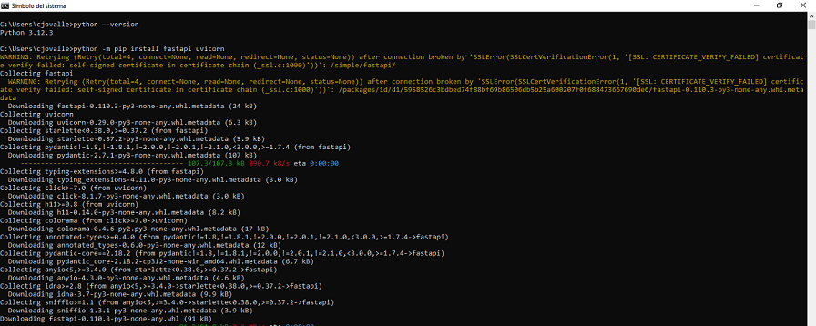
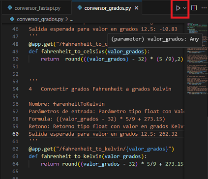
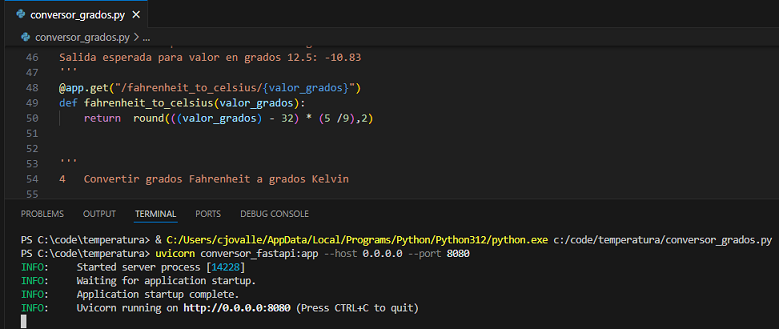

# Taller Pyhon Web Service API - REST

Descargar archivo **conversor_grados.py**

## Descripción

En este taller convertiremos nuestro programa **conversor_grados.py** en un API que pueda exponer servicios web que nos permitiran realizar conversiones entre diferentes escalas de temperatura.

Es asi como las funciones:

* **celsius_to_fahrenheit**
* **celsius_to_kelvin**
* **fahrenheit_to_celsius**
* **fahrenheit_to_kelvin**
* **kelvin_to_celsius**
* **kelvin_to_fahrenheit**

Se convertirán en servicios web que se identifican de forma única mediante una **url** y podremos pedirles realizar cálculos de temperatura mediante el navegador web o una aplicación web construida con: HTML/CSS/JavaScript.

[Conceptos API- REST](https://blog.hubspot.es/website/que-es-api-rest)

## Como lo lograremos?

Para convertir nuestro programa **conversor_grados.py** en un **API** que exponga servicios web, utilizaremos los paquetes **fastapi** y **uvicorn**.
[FastAPI]([https://](https://fastapi.tiangolo.com/es/))

**FastAPI** Es un web framework moderno y rápido (de alto rendimiento) para construir APIs con Python basado en las anotaciones de tipos estándar de Python.


**Uvicorn** Uvicorn es un servidor web ASGI (Asynchronous Server Gateway Interface) que se utiliza para ejecutar aplicaciones FastAPI.


**Agregaremos instrucciones especiales en la definición de cada método, para permitir responder a peticiones http de tipo GET.**

## Convirtiendo nuestro código en un API REST

**1) Usar el gestor de paquetes **pip** para instalar FastAPI y Uvicorn:**

```
python -m pip install fastapi uvicorn
```




**código inicial**

```python
'''
1   Convertir grados Celsius a grados Fahrenheit

parametros de entrada: Parámetro tipo float con Valor en grados Celsius
aplicar formula: (valor en celcius * 9 / 5 + 32) 
retono: Retorno tipo float con valor en grados Fahrenheit
Salida esperada para valor en grados 12.5: 54.5
'''
def celsius_to_fahrenheit(valor_grados):
    return valor_grados * 9 / 5 + 32

'''
2   Convertir grados Celsius a grados Kelvin

parametros de entrada: Parámetro tipo float con Valor en grados Celsius
aplicar formula: valor en celcius + 273.15	
retono: Retorno tipo float con valor en grados Kelvin
Salida esperada para valor en grados 12.5: 285.65
'''
def celsius_to_kelvin(valor_grados):
    return valor_grados + 273.15

'''
3   Convertir grados Fahrenheit a grados Celsius

parametros de entrada: Parámetro tipo float con Valor en grados Fahrenheit
aplicar formula: ((valor en fahrenheit - 32) * (5 /9)
retono: Retorno tipo float con valor en grados Celsius 
Salida esperada para valor en grados 12.5: -10.83   
'''
def fahrenheit_to_celsius(valor_grados):
    return  round(((valor_grados) - 32) * (5 /9),2)


'''
4   Convertir grados Fahrenheit a grados Kelvin	

Nombre: farenheitToKelvin
Parámetros de entrada: Parámetro tipo float con Valor en grados Fahrenheit
Formula: ((valor_grados - 32) * 5/9 + 273.15)
Retono: Retorno tipo float con valor en grados Kelvin
Salida esperada para valor en grados 12.5: 262.32
'''
def fahrenheit_to_kelvin(valor_grados):
    return round((valor_grados - 32) * 5/9 + 273.15,2)
    

'''
5   Convertir grados Kelvin a grados Celsius

Nombre: kelvinToCelsius
Parámetros de entrada: Parámetro tipo float con Valor en grados Kelvin
Formula: (valor_grados - 273.15)
Retono: Retorno tipo float con valor en grados Celsius
Salida esperada para valor en grados 12.5: -260.65
'''
def kelvin_to_celsius(valor_grados):
    return (valor_grados - 273.15)

'''
6   Convertir grados Kelvin a grados Fahrenheit	
Nombre: kelvinToFarenheit
Parámetros de entrada: Parámetro tipo float con Valor en grados Kelvin
Formula: ((valor_grados -  273.15) * (9/5 + 32))
Retono: Retorno tipo float con valor en grados Fahrenheit
Salida esperada para valor en grados 12.5: -437.17
'''
def kelvin_to_fahrenheit(valor_grados):
    return round((valor_grados -  273.15) * 9/5 + 32,2)


grados = float(input("Ingresa los grados de la temperatura :\t"))

#invocamos la función
print(f"El resultado de convertir {grados} celcius a Fahrenheit, es:\t {celsius_to_fahrenheit(grados)}")
print(f"El resultado de convertir {grados} celcius a Kelvin, es:\t {celsius_to_kelvin(grados)}")
print(f"El resultado de convertir {grados} Fahrenheit a Celsius, es:\t {fahrenheit_to_celsius(grados)}")
print(f"El resultado de convertir {grados} Fahrenheit a Kelvin, es:\t {fahrenheit_to_kelvin(grados)}")
print(f"El resultado de convertir {grados} Kelvin a Celsius, es:\t {kelvin_to_celsius(grados)}")
print(f"El resultado de convertir {grados} Kelvin a Fahrenheit, es:\t {kelvin_to_fahrenheit(grados)}")


```

**2) Agregar sentencias import al inicio del código para usar e instanciar a FastAPI y Uvicorn**

```python
import uvicorn
from fastapi import FastAPI
from fastapi.middleware.cors import CORSMiddleware

#Llamamos a FastAPI, y desde este momento haremos referencia a este mediante la variable 'app'
app = FastAPI()

#programa original desde aqui...
```

**Código resultante:**

```python
import uvicorn
from fastapi import FastAPI
from fastapi.middleware.cors import CORSMiddleware

#Llamamos a FastAPI, y desde este momento haremos referencia a este mediante la variable 'app'
app = FastAPI()

'''
1   Convertir grados Celsius a grados Fahrenheit

parametros de entrada: Parámetro tipo float con Valor en grados Celsius
aplicar formula: (valor en celcius * 9 / 5 + 32) 
retono: Retorno tipo float con valor en grados Fahrenheit
Salida esperada para valor en grados 12.5: 54.5
'''
def celsius_to_fahrenheit(valor_grados):
    return valor_grados * 9 / 5 + 32

'''
2   Convertir grados Celsius a grados Kelvin

parametros de entrada: Parámetro tipo float con Valor en grados Celsius
aplicar formula: valor en celcius + 273.15	
retono: Retorno tipo float con valor en grados Kelvin
Salida esperada para valor en grados 12.5: 285.65
'''
def celsius_to_kelvin(valor_grados):
    return valor_grados + 273.15

'''
3   Convertir grados Fahrenheit a grados Celsius

parametros de entrada: Parámetro tipo float con Valor en grados Fahrenheit
aplicar formula: ((valor en fahrenheit - 32) * (5 /9)
retono: Retorno tipo float con valor en grados Celsius 
Salida esperada para valor en grados 12.5: -10.83   
'''
def fahrenheit_to_celsius(valor_grados):
    return  round(((valor_grados) - 32) * (5 /9),2)


'''
4   Convertir grados Fahrenheit a grados Kelvin	

Nombre: farenheitToKelvin
Parámetros de entrada: Parámetro tipo float con Valor en grados Fahrenheit
Formula: ((valor_grados - 32) * 5/9 + 273.15)
Retono: Retorno tipo float con valor en grados Kelvin
Salida esperada para valor en grados 12.5: 262.32
'''
def fahrenheit_to_kelvin(valor_grados):
    return round((valor_grados - 32) * 5/9 + 273.15,2)
    

'''
5   Convertir grados Kelvin a grados Celsius

Nombre: kelvinToCelsius
Parámetros de entrada: Parámetro tipo float con Valor en grados Kelvin
Formula: (valor_grados - 273.15)
Retono: Retorno tipo float con valor en grados Celsius
Salida esperada para valor en grados 12.5: -260.65
'''
def kelvin_to_celsius(valor_grados):
    return (valor_grados - 273.15)

'''
6   Convertir grados Kelvin a grados Fahrenheit	
Nombre: kelvinToFarenheit
Parámetros de entrada: Parámetro tipo float con Valor en grados Kelvin
Formula: ((valor_grados -  273.15) * (9/5 + 32))
Retono: Retorno tipo float con valor en grados Fahrenheit
Salida esperada para valor en grados 12.5: -437.17
'''
def kelvin_to_fahrenheit(valor_grados):
    return round((valor_grados -  273.15) * 9/5 + 32,2)


grados = float(input("Ingresa los grados de la temperatura :\t"))

#invocamos la función
print(f"El resultado de convertir {grados} celcius a Fahrenheit, es:\t {celsius_to_fahrenheit(grados)}")
print(f"El resultado de convertir {grados} celcius a Kelvin, es:\t {celsius_to_kelvin(grados)}")
print(f"El resultado de convertir {grados} Fahrenheit a Celsius, es:\t {fahrenheit_to_celsius(grados)}")
print(f"El resultado de convertir {grados} Fahrenheit a Kelvin, es:\t {fahrenheit_to_kelvin(grados)}")
print(f"El resultado de convertir {grados} Kelvin a Celsius, es:\t {kelvin_to_celsius(grados)}")
print(f"El resultado de convertir {grados} Kelvin a Fahrenheit, es:\t {kelvin_to_fahrenheit(grados)}")
```

**3 Agregar instrucciones para evitar bloqueos de seguridad tipo CORS**
```python

#despues de.... 
#Llamamos a FastAPI, y desde este momento haremos referencia a este mediante la variable 'app'
app = FastAPI()

#Agregar...

# Permitir solicitudes desde todos los orígenes
app.add_middleware(
    CORSMiddleware,
    allow_origins=["*"],  # Puedes restringir esto a los orígenes que desees permitir
    allow_credentials=True,
    allow_methods=["GET"],
    allow_headers=["*"],
)
```

**Código resultante:**
```python
import uvicorn
from fastapi import FastAPI
from fastapi.middleware.cors import CORSMiddleware

#Llamamos a FastAPI, y desde este momento haremos referencia a este mediante la variable 'app'
app = FastAPI()

app.add_middleware(
    CORSMiddleware,
    allow_origins=["*"],  # Puedes restringir esto a los orígenes que desees permitir
    allow_credentials=True,
    allow_methods=["GET"],
    allow_headers=["*"],
)

'''
1   Convertir grados Celsius a grados Fahrenheit

parametros de entrada: Parámetro tipo float con Valor en grados Celsius
aplicar formula: (valor en celcius * 9 / 5 + 32) 
retono: Retorno tipo float con valor en grados Fahrenheit
Salida esperada para valor en grados 12.5: 54.5
'''
def celsius_to_fahrenheit(valor_grados):
    return valor_grados * 9 / 5 + 32

'''
2   Convertir grados Celsius a grados Kelvin

parametros de entrada: Parámetro tipo float con Valor en grados Celsius
aplicar formula: valor en celcius + 273.15	
retono: Retorno tipo float con valor en grados Kelvin
Salida esperada para valor en grados 12.5: 285.65
'''
def celsius_to_kelvin(valor_grados):
    return valor_grados + 273.15

'''
3   Convertir grados Fahrenheit a grados Celsius

parametros de entrada: Parámetro tipo float con Valor en grados Fahrenheit
aplicar formula: ((valor en fahrenheit - 32) * (5 /9)
retono: Retorno tipo float con valor en grados Celsius 
Salida esperada para valor en grados 12.5: -10.83   
'''
def fahrenheit_to_celsius(valor_grados):
    return  round(((valor_grados) - 32) * (5 /9),2)


'''
4   Convertir grados Fahrenheit a grados Kelvin	

Nombre: farenheitToKelvin
Parámetros de entrada: Parámetro tipo float con Valor en grados Fahrenheit
Formula: ((valor_grados - 32) * 5/9 + 273.15)
Retono: Retorno tipo float con valor en grados Kelvin
Salida esperada para valor en grados 12.5: 262.32
'''
def fahrenheit_to_kelvin(valor_grados):
    return round((valor_grados - 32) * 5/9 + 273.15,2)
    

'''
5   Convertir grados Kelvin a grados Celsius

Nombre: kelvinToCelsius
Parámetros de entrada: Parámetro tipo float con Valor en grados Kelvin
Formula: (valor_grados - 273.15)
Retono: Retorno tipo float con valor en grados Celsius
Salida esperada para valor en grados 12.5: -260.65
'''
def kelvin_to_celsius(valor_grados):
    return (valor_grados - 273.15)

'''
6   Convertir grados Kelvin a grados Fahrenheit	
Nombre: kelvinToFarenheit
Parámetros de entrada: Parámetro tipo float con Valor en grados Kelvin
Formula: ((valor_grados -  273.15) * (9/5 + 32))
Retono: Retorno tipo float con valor en grados Fahrenheit
Salida esperada para valor en grados 12.5: -437.17
'''
def kelvin_to_fahrenheit(valor_grados):
    return round((valor_grados -  273.15) * 9/5 + 32,2)


grados = float(input("Ingresa los grados de la temperatura :\t"))

#invocamos la función
print(f"El resultado de convertir {grados} celcius a Fahrenheit, es:\t {celsius_to_fahrenheit(grados)}")
print(f"El resultado de convertir {grados} celcius a Kelvin, es:\t {celsius_to_kelvin(grados)}")
print(f"El resultado de convertir {grados} Fahrenheit a Celsius, es:\t {fahrenheit_to_celsius(grados)}")
print(f"El resultado de convertir {grados} Fahrenheit a Kelvin, es:\t {fahrenheit_to_kelvin(grados)}")
print(f"El resultado de convertir {grados} Kelvin a Celsius, es:\t {kelvin_to_celsius(grados)}")
print(f"El resultado de convertir {grados} Kelvin a Fahrenheit, es:\t {kelvin_to_fahrenheit(grados)}")
```

**4 Agregar anotaciones de Fastapi a cada uno de los métodos y eliminar código de llamado local**

* @app.get("/celsius_to_fahrenheit/{valor_grados}")
* @app.get("/celsius_to_kelvin/{valor_grados}")
* @app.get("/fahrenheit_to_celsius/{valor_grados}")
* @app.get("/fahrenheit_to_kelvin/{valor_grados}")
* @app.get("/kelvin_to_celsius/{valor_grados}")
* @app.get("/kelvin_to_fahrenheit/{valor_grados}")

**Eliminar estas lineas de código, ya no serán necesarias**

```python
grados = float(input("Ingresa los grados de la temperatura :\t"))

#invocamos la función
print(f"El resultado de convertir {grados} celcius a Fahrenheit, es:\t {celsius_to_fahrenheit(grados)}")
print(f"El resultado de convertir {grados} celcius a Kelvin, es:\t {celsius_to_kelvin(grados)}")
print(f"El resultado de convertir {grados} Fahrenheit a Celsius, es:\t {fahrenheit_to_celsius(grados)}")
print(f"El resultado de convertir {grados} Fahrenheit a Kelvin, es:\t {fahrenheit_to_kelvin(grados)}")
print(f"El resultado de convertir {grados} Kelvin a Celsius, es:\t {kelvin_to_celsius(grados)}")
print(f"El resultado de convertir {grados} Kelvin a Fahrenheit, es:\t {kelvin_to_fahrenheit(grados)}")
```

Nuestros métodos con anotaciones FastAPI para soportar peticiones http tipo get quedaría Asi:

```python
@app.get("/celsius_to_fahrenheit/{valor_grados}")
def celsius_to_fahrenheit(valor_grados):
    return valor_grados * 9 / 5 + 32


@app.get("/celsius_to_kelvin/{valor_grados}")
def celsius_to_kelvin(valor_grados):
    return valor_grados + 273.15

@app.get("/fahrenheit_to_celsius/{valor_grados}")
def fahrenheit_to_celsius(valor_grados):
    return  round(((valor_grados) - 32) * (5 /9),2)

@app.get("/fahrenheit_to_kelvin/{valor_grados}")
def fahrenheit_to_kelvin(valor_grados):
    return round((valor_grados - 32) * 5/9 + 273.15,2)

@app.get("/kelvin_to_celsius/{valor_grados}")
def kelvin_to_celsius(valor_grados):
    return (valor_grados - 273.15)

@app.get("/kelvin_to_fahrenheit/{valor_grados}")
def kelvin_to_fahrenheit(valor_grados):
    return round((valor_grados -  273.15) * 9/5 + 32,2)
```

**Código resultante:**

```python
import uvicorn
from fastapi import FastAPI
from fastapi.middleware.cors import CORSMiddleware

#Llamamos a FastAPI, y desde este momento haremos referencia a este mediante la variable 'app'
app = FastAPI()

app.add_middleware(
    CORSMiddleware,
    allow_origins=["*"],  # Puedes restringir esto a los orígenes que desees permitir
    allow_credentials=True,
    allow_methods=["GET"],
    allow_headers=["*"],
)

'''
1   Convertir grados Celsius a grados Fahrenheit

parametros de entrada: Parámetro tipo float con Valor en grados Celsius
aplicar formula: (valor en celcius * 9 / 5 + 32) 
retono: Retorno tipo float con valor en grados Fahrenheit
Salida esperada para valor en grados 12.5: 54.5
'''
@app.get("/celsius_to_fahrenheit/{valor_grados}")
def celsius_to_fahrenheit(valor_grados):
    return valor_grados * 9 / 5 + 32

'''
2   Convertir grados Celsius a grados Kelvin

parametros de entrada: Parámetro tipo float con Valor en grados Celsius
aplicar formula: valor en celcius + 273.15	
retono: Retorno tipo float con valor en grados Kelvin
Salida esperada para valor en grados 12.5: 285.65
'''
@app.get("/celsius_to_kelvin/{valor_grados}")
def celsius_to_kelvin(valor_grados):
    return valor_grados + 273.15

'''
3   Convertir grados Fahrenheit a grados Celsius

parametros de entrada: Parámetro tipo float con Valor en grados Fahrenheit
aplicar formula: ((valor en fahrenheit - 32) * (5 /9)
retono: Retorno tipo float con valor en grados Celsius 
Salida esperada para valor en grados 12.5: -10.83   
'''
@app.get("/fahrenheit_to_celsius/{valor_grados}")
def fahrenheit_to_celsius(valor_grados):
    return  round(((valor_grados) - 32) * (5 /9),2)


'''
4   Convertir grados Fahrenheit a grados Kelvin	

Nombre: farenheitToKelvin
Parámetros de entrada: Parámetro tipo float con Valor en grados Fahrenheit
Formula: ((valor_grados - 32) * 5/9 + 273.15)
Retono: Retorno tipo float con valor en grados Kelvin
Salida esperada para valor en grados 12.5: 262.32
'''
@app.get("/fahrenheit_to_kelvin/{valor_grados}")
def fahrenheit_to_kelvin(valor_grados):
    return round((valor_grados - 32) * 5/9 + 273.15,2)
    

'''
5   Convertir grados Kelvin a grados Celsius

Nombre: kelvinToCelsius
Parámetros de entrada: Parámetro tipo float con Valor en grados Kelvin
Formula: (valor_grados - 273.15)
Retono: Retorno tipo float con valor en grados Celsius
Salida esperada para valor en grados 12.5: -260.65
'''
@app.get("/kelvin_to_celsius/{valor_grados}")
def kelvin_to_celsius(valor_grados):
    return (valor_grados - 273.15)

'''
6   Convertir grados Kelvin a grados Fahrenheit	
Nombre: kelvinToFarenheit
Parámetros de entrada: Parámetro tipo float con Valor en grados Kelvin
Formula: ((valor_grados -  273.15) * (9/5 + 32))
Retono: Retorno tipo float con valor en grados Fahrenheit
Salida esperada para valor en grados 12.5: -437.17
'''
@app.get("/kelvin_to_fahrenheit/{valor_grados}")
def kelvin_to_fahrenheit(valor_grados):
    return round((valor_grados -  273.15) * 9/5 + 32,2)

```
## Como ejecutar nuestro programa e iniciar el servidor/servicio:
Ejecutar programa con normalidad



Escribir la instrucción: 

```text
uvicorn conversor_fastapi:app --host 0.0.0.0 --port 8080
```



## Como acceder a la documentación y probar nuestros servicios

[Acceso API Documentación Swagger](http://localhost:8080/docs)


## Como invocar a nuestros servicios:

Abrir un navegador web y escribir las url de ejemplo que se muestran a continuación:

**Convertir grados Celsius a grados Fahrenheit:**
[Clic aqui:](http://localhost:8080/celsius_to_fahrenheit/12.5)
```text
URL DEL SERVICIO: http://localhost:8080/celsius_to_fahrenheit/{valor_grados}
```

**Convertir grados Celsius a grados Kelvin:**
[Clic aqui:](http://localhost:8080/celsius_to_kelvin/12.5)
```text
URL DEL SERVICIO: http://localhost:8080/celsius_to_kelvin/{valor_grados}
```

**Convertir grados Fahrenheit a grados Celsius:**
[Clic aqui:](http://localhost:8080/fahrenheit_to_celsius/12.5)
```text
URL DEL SERVICIO: http://localhost:8080/fahrenheit_to_celsius/{valor_grados}
```

**Convertir grados Fahrenheit a grados Kelvin:**
[Clic aqui:](http://localhost:8080/fahrenheit_to_kelvin/12.5)
```text
URL DEL SERVICIO: http://localhost:8080/fahrenheit_to_kelvin/{valor_grados}
```


**Convertir grados Kelvin a grados Celsius:**
[Clic aqui:](http://localhost:8080/kelvin_to_celsius/12.5)
```text
URL DEL SERVICIO: http://localhost:8080/kelvin_to_celsius/{valor_grados}
```

**Convertir grados Kelvin a grados Fahrenheit:**
[Clic aqui:](http://localhost:8080/kelvin_to_fahrenheit/12.5)
```text
URL: http://localhost:8080/kelvin_to_fahrenheit/{valor_grados}
```
